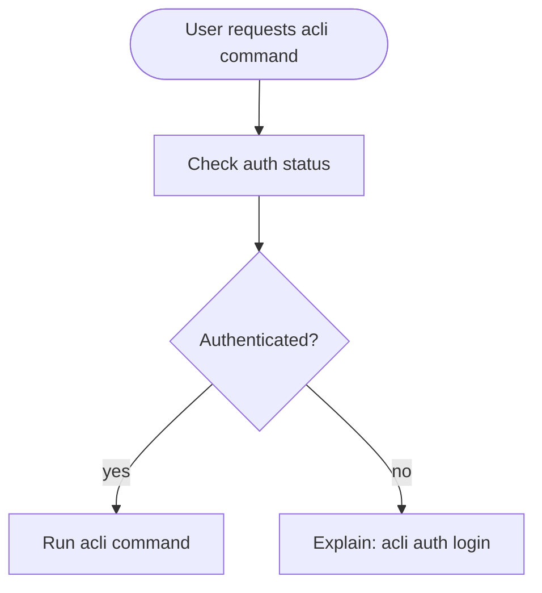
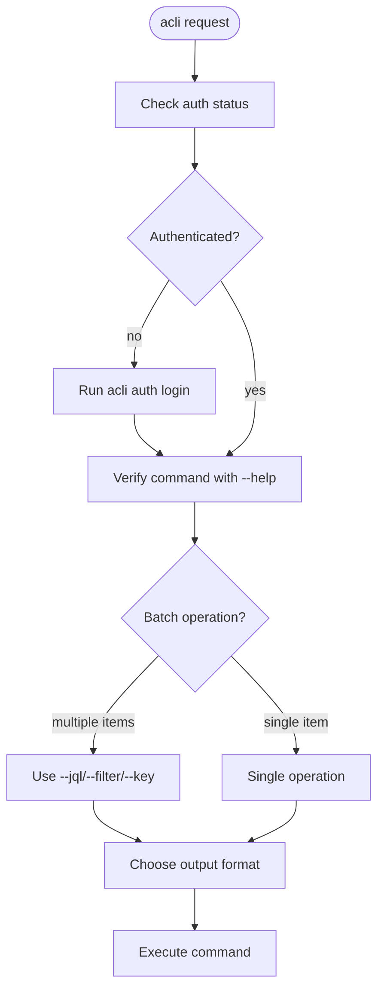

<!-- Based on the acli skill from https://github.com/leweii/atlassian-cli, MIT licensed. -->

# Atlassian CLI (acli)

## Overview

The Atlassian CLI (`acli`) provides command-line access to Jira, Confluence, and other Atlassian products. **Core principle:** Always check authentication first, use correct command structure, and leverage batch operations.

This reference was verified against **acli 1.3.39-stable** (October 2026). If `acli --version` reports a newer release, do not assume this reference is complete: check `acli <product> --help` for the current command surface, and the upstream repo (https://github.com/leweii/atlassian-cli) or https://developer.atlassian.com/cloud/acli/ for release notes on new features.

## When to Use

- Creating, searching, or updating Jira issues
- Managing sprints, boards, or projects
- Working with Confluence spaces
- Bulk operations on multiple items
- Generating reports in CSV/JSON format
- Automating Atlassian workflows

**When NOT to use:**
- When web UI is more appropriate (one-off visual tasks)
- When API tokens/integrations are already available

## acli vs Atlassian MCP

Atlassian also ships a hosted remote MCP server (Rovo MCP v2, `https://mcp.atlassian.com/v2/mcp`). When an Atlassian MCP connection is available in your environment (pi, Claude Code), split work between the two:

**Prefer the MCP server when:**
- Single-issue reads and writes (Jira get/search/create/edit/transition/comment, Confluence get/create/update/search are first-class tools with richer, self-describing responses)
- Semantic search across Jira/Confluence (Rovo `search`)
- Cross-product relationship queries (Teamwork Graph: `getGraphContext`/`getGraphObject`)
- Work in products acli does not cover: Compass, Bitbucket, Teams, Goals, Focus (via `discover` + `executeRead`/`executeWrite`/`executeDestructive`, ~315 operations)
- Destructive operations should be separately permission-gated (MCP exposes them as a dedicated `executeDestructive` tool)

**Prefer acli when:**
- Bulk operations: `create-bulk`, or `edit`/`transition`/`assign` with `--jql`/`--filter`/`--key` plus `--yes`. The MCP server has no batching primitive; an agent would have to loop one call per issue
- Reports and data export: `--csv`, `--fields`, `--count`, `--paginate`
- Sprint, board, worklog, release, and field-history questions: these need purpose-built endpoints, not JQL; acli has first-class `sprint`/`board` entities
- Saved-filter targeting (`--filter <id>`)
- No MCP connection is configured

Both cover the core loop (read, JQL/CQL search, create, edit, transition, comment) with rough parity; either is fine there.

**MCP version note:** v2 (GA 2026-09-08) exposes a curated 21-tool list plus the `discover`/`execute` family; it renamed several v1 tools (`getConfluencePage` became `getConfluenceContent`, `addCommentToJiraIssue` became `addOrEditJiraIssueComment`) and removed most v1-era granular tools behind `discover`/`execute`. A cached v1 tool list (about 40 tools) is stale: probe the server with `tools/list` instead of trusting caches.

## Authentication - FIRST STEP ALWAYS



**Before ANY acli operation:**
```bash
# Check if authenticated
acli auth status

# If not authenticated, login first
acli auth login
```

## Command Structure

**Format:** `acli <product> <entity> <action> [flags]`

**DO NOT use old-style syntax with `--action` flag.**

```bash
# WRONG - old syntax that doesn't work
acli jira --action getIssueList --jql "..."

# CORRECT - modern syntax
acli jira workitem search --jql "..."
```

## Quick Reference

### Common Products
- `auth` - Authentication management (multiple accounts, OAuth)
- `jira` - Jira Cloud commands
- `confluence` - Confluence Cloud commands
- `admin` - Admin operations
- `guard` - Atlassian Guard CLI
- `rovodev` - Rovo Dev, Atlassian's AI coding agent (Beta)
- `config` - Configuration settings

### Jira Entities & Actions

| Entity | Common Actions | Example |
|--------|---------------|---------|
| `workitem` | search, create, create-bulk, edit, view, transition, assign, delete, archive, unarchive, clone, link, attachment, watcher, list-watchers | `acli jira workitem search --jql "project = TEAM"` |
| `project` | list, view, create, update, delete, archive, restore | `acli jira project list` |
| `sprint` | create, update, view, delete, list-workitems | `acli jira sprint view --id 123` |
| `board` | search, view (get is deprecated), create, delete, list-sprints, list-projects | `acli jira board list-sprints --id 42` |
| `workitem comment` | create, list, update, delete, visibility | `acli jira workitem comment create --key KEY-1 --body "text"` |

### Confluence Entities

| Entity | Actions | Example |
|--------|---------|---------|
| `space` | list, view, create, update, archive, restore | `acli confluence space list` |
| `page` | view | `acli confluence page view 12345` |
| `blog` | list, view, create | `acli confluence blog list --space TEAM` |

## Batch Operations

**Use JQL, filters, or key lists to operate on multiple items:**

```bash
# Edit multiple issues with JQL
acli jira workitem edit --jql "project = MOBILE AND status = 'In Review'" --assignee "user@example.com" --yes

# Transition multiple issues
acli jira workitem transition --jql "assignee = currentUser() AND status = 'To Do'" --status "In Progress" --yes

# Search with filter
acli jira workitem search --filter 10001 --csv

# Multiple keys
acli jira workitem assign --key "KEY-1,KEY-2,KEY-3" --assignee "@me"
```

**Batch flags:**
- `--jql` - JQL query for multiple items
- `--filter` - Filter ID for saved searches
- `--key` - Comma-separated issue keys
- `--yes` / `-y` - Skip confirmation prompts
- `--ignore-errors` - Continue on errors (useful for bulk ops)

## Output Formats

**Choose the right output format for your use case:**

```bash
# CSV for spreadsheets
acli jira workitem search --jql "sprint = 42" --csv

# JSON for scripts/automation
acli jira workitem search --jql "project = API" --json

# Web browser for viewing
acli jira workitem view KEY-123 --web

# Custom fields (default includes key, summary, status, etc.)
acli jira workitem search --jql "..." --fields "key,summary,assignee,priority"
```

**Common flags:**
- `--csv` - CSV output (NOT --outputFormat 999)
- `--json` - JSON output
- `--web` - Open in web browser
- `--fields` - Specify which fields to display (NOT --columns)
- `--count` - Show count only
- `--paginate` - Fetch all results

## Bulk Creation

**For creating multiple similar issues:**

```bash
# Generate JSON template
acli jira workitem create --generate-json

# Create from JSON file
acli jira workitem create --from-json workitem.json

# Bulk create multiple issues from a JSON array (--from-csv issues.csv also works)
acli jira workitem create-bulk --from-json issues.json

# Print the JSON array shape expected by create-bulk
acli jira workitem create-bulk --generate-json

# Use file for description
acli jira workitem create --summary "Bug title" --project API --type Bug --from-file description.txt

# Use editor for interactive creation
acli jira workitem create --editor
```

**Don't create bash loops with 10 individual create commands when `create-bulk` or `--from-json` exists.**

## Common JQL Patterns

```bash
# Current user's issues
--jql "assignee = currentUser()"

# Specific project and status
--jql "project = TEAM AND status = 'In Progress'"

# Multiple criteria
--jql "project = API AND type = Bug AND status != Done"

# Sprint issues
--jql "project = TEAM AND sprint = 42"

# Recent updates
--jql "project = WEBAPP AND updated >= -7d"
```

## Common Mistakes

| Mistake | Why It's Wrong | Correct Approach |
|---------|---------------|-----------------|
| Skipping auth check | Commands fail without authentication | Always run `acli auth status` first |
| Using `--action` flag | Old syntax doesn't work in modern acli | Use `acli <product> <entity> <action>` |
| `--outputFormat 999` | Wrong flag | Use `--csv` |
| `--columns` parameter | Doesn't exist | Use `--fields` |
| Bash loops for creation | Inefficient, built-in features exist | Use `create-bulk`, `--from-json` |
| One-by-one edits | Slow for bulk operations | Use `--jql` or `--filter` with edit/transition |
| Making up commands | Wastes time | Run `acli <product> <entity> --help` to verify |

## Red Flags - STOP and Check Skill

These indicate you're about to make a mistake:

- Skipping authentication check
- Using `--action` in your command
- Writing bash loops for bulk operations
- Suggesting `--outputFormat` instead of `--csv`
- Using `--columns` instead of `--fields`
- Making up command names without checking --help
- "The old syntax probably still works"
- "They're probably already authenticated"
- "A bash loop is more flexible than built-in commands"

**All of these mean: Stop, re-read this skill, use correct syntax.**

## Workflow Pattern



## Example Workflows

### Sprint Report
```bash
# 1. Check auth
acli auth status

# 2. Search sprint issues with CSV output
acli jira workitem search --jql "project = TEAM AND sprint = 42" --fields "key,summary,status,assignee" --csv > sprint-report.csv
```

### Bulk Status Update
```bash
# 1. Check auth
acli auth status

# 2. Verify issues first
acli jira workitem search --jql "project = MOBILE AND status = 'In Review'" --count

# 3. Transition all
acli jira workitem transition --jql "project = MOBILE AND status = 'In Review'" --status "Done" --yes

# 4. Assign all
acli jira workitem assign --jql "project = MOBILE AND status = Done" --assignee "user@example.com" --yes
```

### Create Multiple Issues
```bash
# 1. Check auth
acli auth status

# 2. Generate a bulk template (a JSON array of issues)
acli jira workitem create-bulk --generate-json > issues.json

# 3. Edit issues.json with one array entry per issue

# 4. Create all issues in one call
acli jira workitem create-bulk --from-json issues.json
```

## Getting Help

```bash
# Top-level help
acli --help

# Product help
acli jira --help

# Entity help
acli jira workitem --help

# Action help
acli jira workitem search --help
```

**When in doubt, check `--help` for exact flags and syntax.**
